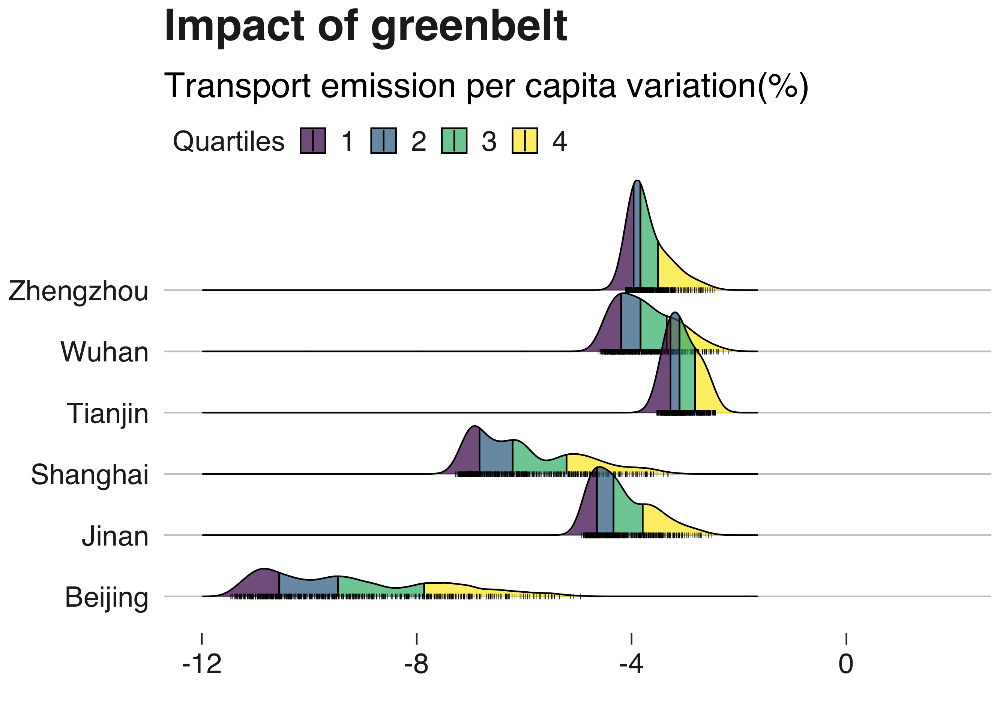

{}
 See [Here](https://anr.fr/Projet-ANR-14-ORAR-0005) the project informations on ANR website and [here](https://www.centre-cired.fr/wp-content/uploads/2022/06/delivrable_final.pdf) for the final report of the project.
{}

# Summary of the DRAGON project: Economy-energy-environment nexus and its impact on green growth in cities



## Simulating city growth to assess the economic and environmental impacts of urban transport and land-use policies.
Beyond national policies, city-level policies are more and more recognized as key components of global strategies to mitigate GHG emissions. In particular, land-use regulations, transport taxation, or investments in clean transportation modes could reduce car use. However, each city is different, and types of urbanization and urban form have a major impact on the effectiveness of potential public policies. Little is known on how the efficiency of mitigation policies varies when these policies are implemented in cities of various characteristics. In this project, we use a simulation approach, applying a model derived from the Standard Urban Model of urban economics to a sample of 192 cities on 5 continents to analyze how the interplay between transport, economic forces and environmental issues impact the evolution of greenhouse gases emissions in urban transport. 
Our results are a first step towards a better understanding of the aggregated potential global outcomes of cities policies. They also highlight that there is no one-size-fits-all optimal policy to mitigate urban transport emissions: we call for global climate mitigation models to better represent heterogeneity across cities.

## An innovative integrated modelling approach, systematically applied to 192 cities worldwide

A systemic approach has been developed to gather data on cities and model the consequence, on land consumption and greenhouse gases emissions, of policies they may implement. We first collected a novel data set of spatialized city characteristics for 192 cities worldwide. This dataset was built using long and complex web-scrapping procedures. The cities are located on the 5 continents, and differ by their size, level of development, histories and climate. They represent together a third of all the people living in cities of more than 300 000 inhabitants.  We then designed a mathematical framework to systematically calibrate, on each city, a land-use transport interaction model, NEDUM, and to assess statistically the robustness of the calibration coefficients. The models were finally used to downscale, at city scale, global techno- economic scenarios similar to those used in the SSP database, hence  analyzing the potential impacts of several transport and land-use policies in each city in prospective scenarios coherent with the global scenarios used in IPCC reports. 

## Major results of the project 

Cities are key players in global environmental issues. However, each city is different, and assessing the potential role of the multiple policies that they can implement is a difficult task. In the project, we originally aimed to simulate and compare the potential consequences of several policies on urban transport emissions in 6 Chinese cities. However, the approach that we developped proved to be more powerful than anticipated, and, thanks to the progressive availability of data during the lifetime of the project, we managed to systematically simulate the impacts of the policies in about 200 cities worldwide, taking into account their fine geographical, social and economic characteristics. These cities are situated on all continents, and gather about a third of the population of all cities of more than 300 000 inhabitants.

## Scientific production and outcomes 
We created a unique database of spatially explicit data on rents, real estate prices, population densities and transport times (with different transport modes) in about 200 cities worldwide. Each city is divided in 1000 to 15 000 neighborhoods of 1km2, and data were collected for each neighborhood of each city of our sample. 
We also developed a modified version of a land-use transport interaction model, NEDUM, which was then calibrated on each of the cities of the database, enabling to derive prospective scenarios on the evolution of different characteristics of the cities, such as the location of new buildings, changes in real estate prices etc. 
10 publications, including 6 peer-reviewed research articles in major scientific journals  (2 other articles are currently under review), and more than 17 presentations to academic conferences resulted from this research project. 

## Factual information
This fundamental research project was coordinated by CIRED, and is part of a larger international project involving the University of East Anglia, UK, the University of Bristol, UK, Tsinghua University, China, China’s Research Academy of Environmental Sciences, Beijing Institute of Technology, China, and the Wuppertal Institut fuer Klima, Germany. It started in 01/11/2014 and lasted until 01/09/2020, following several extensions due to the covid pandemics and initial difficulties in the hiring of researchers. It benefited from ANR funding by 365 000 € out of a global cost of about 1 million euros.

